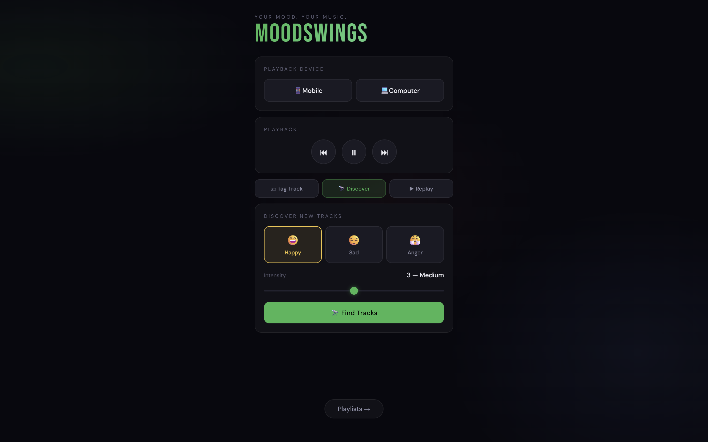
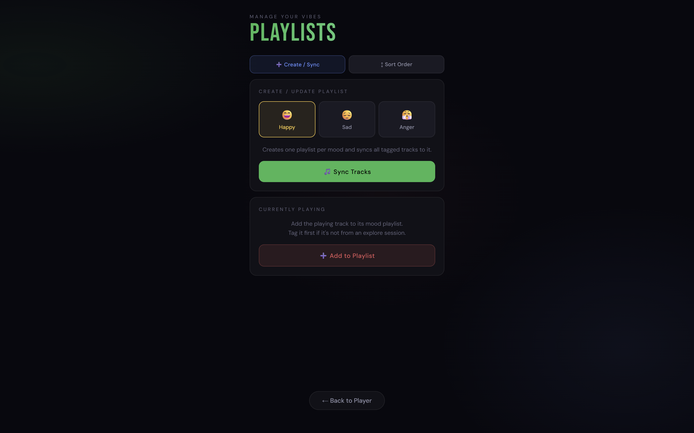

# MoodSwings

A Spotify-connected web app that tags your music by mood and intensity, then uses a **genre-weighted recommendation engine** to discover new tracks that match how you feel right now





---

## Features

- **Tag tracks** — label the currently playing song with a mood (happiness / sadness / anger) and an intensity scale (1–5)
- **Replay by mood** — play back your tagged tracks, filtered to the closest intensity match
- **Discover new music** — genre-weighted recommendation engine finds new tracks based on your taste profile
- **Playlist management** — create mood playlists and sort them by intensity, ascending or descending
- **Device switching** — send playback to your Mobile or Computer via the Spotify Web API

---

## How the recommendation engine works

When you hit **Discover**, the app builds a personalised genre profile from your tagged tracks:

1. Filters tagged tracks to those within ±1 intensity of your target scale
2. Scores each track by proximity: `score = max(0.1, 3 − |target − track_scale|)`
3. Distributes each track's score across its artists' Spotify genres proportionally
4. Normalises the scores into a genre probability distribution
5. Samples 5 genres via weighted random choice, then queries Spotify Search with `"<mood_synonym> <genre>"` to find matching playlists
6. Randomly selects tracks from those playlists and starts playback

With little or no tagged data, it falls back to generic mood-based search queries. The result is a discovery feed that grows smarter the more you tag.

---

## Project structure

```
moodswings/
├── python/
│   ├── app.py               # Flask routes and JSON API
│   ├── state.py             # Shared in-memory application state
│   ├── playback.py          # Transport controls, device management, mood playback
│   ├── playlists.py         # Playlist creation, track syncing, reordering
│   └── recommendations.py  # Genre-weighted recommendation engine
├── templates/
│   └── index.html           # React single-page UI (rendered by Flask)
├── requirements.txt
├── .env.example
└── .gitignore
```

---

## Requirements

- Python 3.10+
- A **Spotify Premium** account (required for playback control via the Web API)
- A **Spotify Developer application** — create one at [developer.spotify.com](https://developer.spotify.com/dashboard)

---

## Setup

**1. Clone and install dependencies**

```bash
git clone https://github.com/your-username/moodswings.git
cd moodswings
python -m venv .venv
source .venv/bin/activate      # Windows: .venv\Scripts\activate
pip install -r requirements.txt
```

**2. Create your `.env` file**

```bash
cp .env.example .env
```

Open `.env` and fill in your Spotify credentials:

```env
SPOTIFY_CLIENT_ID=your_client_id_here
SPOTIFY_REDIRECT_URI=http://127.0.0.1:5000/callback
```

In your [Spotify Developer Dashboard](https://developer.spotify.com/dashboard), add `http://127.0.0.1:5000/callback` as a Redirect URI for your app.

**3. Run**

```bash
python python/app.py
```

Your browser will open to Spotify's authorisation page. After you approve, you'll be redirected to the app at `http://127.0.0.1:5000/music`.

---

## API endpoints

| Method | Path | Description |
|--------|------|-------------|
| `POST` | `/api/device` | Switch playback to mobile or computer |
| `POST` | `/api/transport` | Skip or go back (`action: "next"` or `"prev"`) |
| `POST` | `/api/record` | Tag the current track with mood + scale |
| `POST` | `/api/play` | Replay tagged tracks by mood + scale |
| `POST` | `/api/explore` | Discover tracks via recommendation engine |
| `POST` | `/api/playlist` | Create / sync a mood playlist |
| `POST` | `/api/playlist/sort` | Reorder playlist by intensity |
| `POST` | `/api/playlist/add` | Add current track to its mood playlist |

All endpoints return JSON: `{ "ok": true }` on success or `{ "ok": false, "error": "..." }` on failure.

---

## Tech stack

- **Backend** — Python, Flask, Spotify Web API (OAuth 2.0 PKCE)
- **Frontend** — React 18, vanilla CSS (no build step required)
- **Auth** — PKCE flow (no client secret stored)
